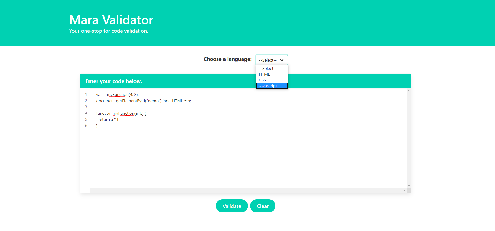
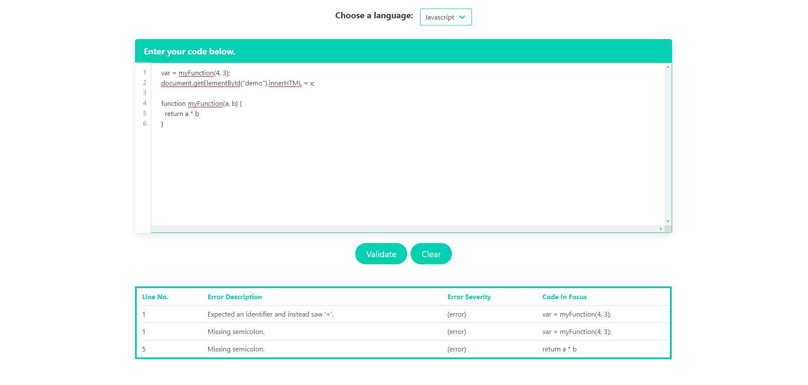

# Mara Validator 

Tired of jumping from website to website checking that all of your code is syntactically correct? Missing errors in the process?

**Your stress is over**, with the Mara Validator! Validate your code, be it HTML, CSS or JS, all in one place. 

https://robynheslop.github.io/mara-validator/

### User Story:
As a web developer, I want to validate my code, written in multiple languages in one place so that I don’t need to visit many websites to cover each language and will be more time efficient. 

### How to use:
1. Enter your code into the numbered text area 
1. Select the code language from the drop down (HTML, CSS or JavaScript)
1. Click validate and wait for the errors to append to the bottom of the page 
1. Click the clear button to remove the previous results and enter some more code to validate! 

### Features:
* Intuitive AI
* Responsive Website
* Clean, tabulated error format 
* Attractive and informative modals appear on every validate button click.

### Sample of Page

Input your code and select the language.

View your errors at the bottom of the page.

### Technologies Utilised:
* jQuery
* BULMA
* JSHint
* W3C HTML Validator API
* W3C CSS Validator API
* NumberedTextArea
* Highlight.js

### Authors
Nitin Mukesh,
Robyn Heslop,
RJ San Jose,

### Code validation
Completed with the Mara Validator

